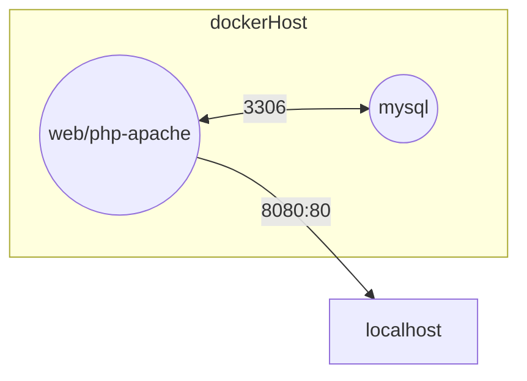

#### Avant-propos: Cas d'école : Deux conteneurs doivent communiquer entre eux

Lorsque deux conteneurs doivent communiquer entre eux, il faut les faire communiquer à l'aide d'un réseau Docker, c'est-à-dire un réseau virtuel qui permet aux conteneurs de se connecter entre eux comme s'ils étaient sur le même réseau local.

Il est possible d'utiliser la commande docker network pour créer un réseau Docker et connecter les conteneurs à ce réseau, mais c'est plus simple d'utiliser Docker Compose qui permet de définir les services, les réseaux et les volumes dans un fichier compose.yml et de lancer l'application avec une seule commande (docker compose up).

        - Étape 1 : Faire le schéma de l'architecture réseau de l'application pour comprendre comment les conteneurs vont communiquer entre eux et avec l'extérieur de Docker.
        - Étape 2 : Créer un fichier compose.yml pour définir les services (conteneurs) de l'application, leurs ports et éventuellement leurs variables d'environnement.
        - Étape 3 : Créer un fichier DockerFile pour les conteneurs réseau qui doivent être paramétrés avant leur démarrage : httpd doit recevoir le code source mais MySQL non donc il n'a pas besoin de DockerFile.
        - Étape 4 : Lancer l'application avec la commande docker compose up et tester que tout fonctionne correctement.

# Exemple de containerisation de plusieurs conteneurs (services) avec Docker Compose

### 1. Schéma de l'architecture réseau de l'application

En résumé mon application ressemble à ça :

php-apache : c'est une image Docker qui contient un serveur web Apache avec PHP installé.

mysql : c'est le serveur de base de données MySQL qui stocke les données de notre site web, il écoute sur le port 3306 à l'intérieur du conteneur et on ne l'expose pas vers l'extérieur du conteneur car il n'est pas nécessaire que les utilisateurs puissent accéder directement à la base de données, le serveur web Apache communique avec MySQL en se connectant au port 3306 du conteneur MySQL avec les bons identifiants.

### 2. *compose.yaml* et arborescence du projet

Message affiché sur http://localhost:8083/ :

        object(PDO)#1 (0) { }
        Test de connexion à la base de données
        Si vous voyez un objet PDO, la connexion à la base de données a réussi.

# Pour les projets de containerisation il faudra toujours :

    1 - Faire un schéma de l'architecture réseau de l'application pour comprendre comment les conteneurs vont communiquer entre eux et avec l'extérieur de Docker.

    2 - Choisir la bonne image sur Docker Hub et vous renseigner sur la configuration nécessaire pour faire fonctionner l'image (ports à exposer, variables d'environnement à définir, etc.).
    3 - Créer un fichier compose.yml pour définir les services (conteneurs) de l'application, leurs ports et éventuellement leurs variables d'environnement.

    4 - Créer un fichier DockerFile pour les conteneurs réseau qui doivent être paramétrés avant leur démarrage avec votre code source ou des dépendances supplémentaires : npm, apt install, etc.

    5 - Écrire le compose.yaml en respectant la syntaxe de Docker Compose et en utilisant les bonnes commandes pour faire communiquer les conteneurs entre eux (depends_on, ports, environment, etc.).

N'OUBLIEZ JAMAIS LE SCHÉMA RÉSEAU !